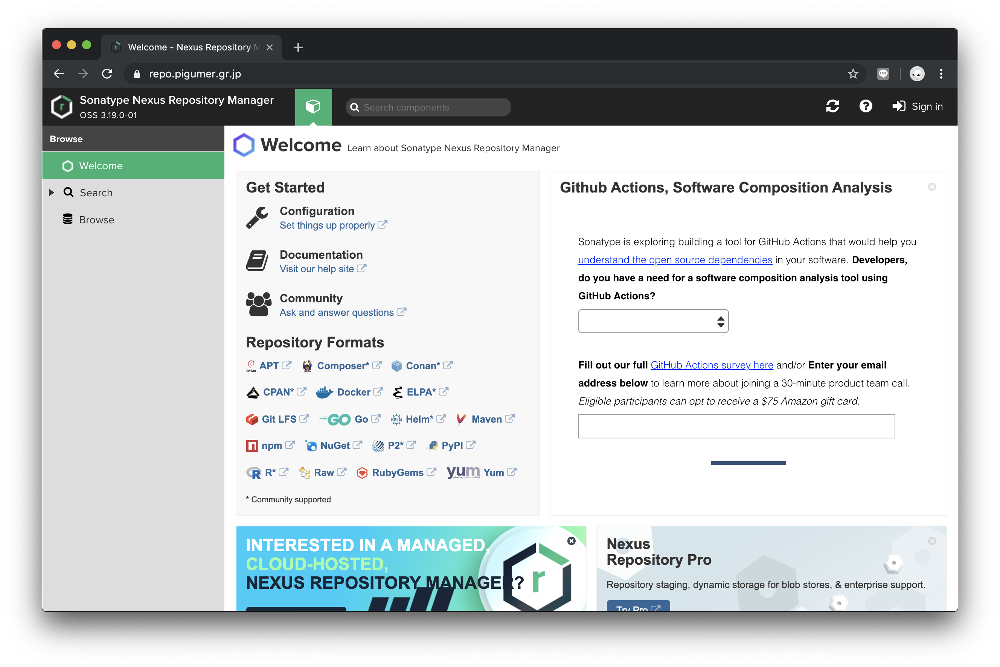

Sonatype Nexus
==============

最初に、[Nexus OSS](https://www.sonatype.com/nexus-repository-oss) をダウンロードして、S3 バケットにアップロードします。

```
$ AWS_PROFILE=<YOUR PROFILE> packer build \
  -var 'bucket_name=<YOUR BUCKET NAME>' \
  -var 'bucket_key=<YOUR DOWNLOADED Nexus>' \
  nexus.json
```

# EFS を使う場合

```
$ echo '<FileSystem ID>:/ /opt/sonatype-work efs defaults,_netdev 0 0' | sudo tee -a /etc/fstab 
```

